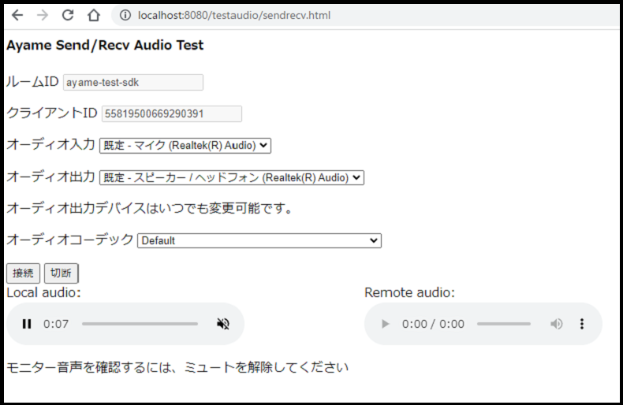

# ayame-web-sdk

## testaudio

オーディオのみ通話するテスト用コードです。以下の順番で実行してください。

1. このプロジェクトは node.js を利用してビルド等を行います。以下を参照して `node.js` および `npm` をインストールしてください。

https://nodejs.org/ja/download/

Windowsの場合は環境変数 `NODE_PATH`に `%APPDATA%\npm\node_modules` を設定してください。

2. npm同様のモジュール管理ツール `yarn` をインストールします。

https://yarnpkg.com/getting-started/install

3. ベースディレクトリで `yarn install` を実行し、依存モジュールをインストールしてください。

2. ベースディレクトリで何らかのスタティックWebサーバーを起動してください。

例えば node-static を利用する場合は、以下のようにインストールした後、

`npm install -g node-static`

ベースディレクトリで以下のように実行します。

`static -c 0 .`

3. WebRTC対応のブラウザで以下のいずれかのURLを開きます。

http://localhost:8080/testaudio/sendonly.html

http://localhost:8080/testaudio/recvonly.html

http://localhost:8080/testaudio/sendrecv.html

## 動作説明

### sendonly.html

ページを開くとマイクの使用がリクエストされ、その後音声入力が始まります。
このときオーディオコントロールのミュート解除を行うと、マイク音声のモニタが可能です (ハウリング音が発生する場合はヘッドセット等を利用してください)

その後「接続」ボタンを押すとayameシグナリングサーバーに接続します。すでに接続相手がいるか、あるいは新しく接続相手が接続するとWebRTC通話(ただし送信のみ一方向)が始まります。
「切断」ボタンを押すか、相手が切断した場合にはWebRTC通話が終了します。再度WebRTC通話を行うには(両側で)再度「接続」ボタンを押してください。

### recvonly.html

このテストではマイクは使用しません。

オーディオコントロールでリモート側音声のボリュームやミュートなどのコントロールを行います。

「接続」ボタンを押すとayameシグナリングサーバーに接続します。すでに接続相手がいるか、あるいは新しく接続相手が接続するとWebRTC通話(ただし受信のみ一方向)が始まります。
「切断」ボタンを押すか、相手が切断した場合にはWebRTC通話が終了します。再度WebRTC通話を行うには(両側で)再度「接続」ボタンを押してください。

### sendrecv.html

双方向の通話テストを行います。



左側のオーディオコントロールでローカル側音声のコントロールを行います。右側のオーディオコントロールでリモート側音声のボリュームやミュートなどのコントロールを行います。

「接続」ボタンを押すとayameシグナリングサーバーに接続します。すでに接続相手がいるか、あるいは新しく接続相手が接続するとWebRTC通話(ただし受信のみ一方向)が始まります。
「切断」ボタンを押すか、相手が切断した場合にはWebRTC通話が終了します。再度WebRTC通話を行うには(両側で)再度「接続」ボタンを押してください。

左側のオーディオコントロールはミュート解除すると(接続中かどうかに関係なく)ローカル音声のモニタが可能です。モニタ中にWebRTC接続すると、モニタ音声とリモート音声はミックスして出力されます。

# Ayame シグナリングサーバー、Room IDの変更

main.jsの以下の記述を変更してください。

```
const signalingUrl = 'wss://ayame-labo.shiguredo.jp/signaling';
let roomId = 'ayame-test-sdk';
```

# .ts ファイルの更新と再ビルド

このディレクトリ内のテスト.htmlファイルは ビルド済みの dist/ayame.js のみを参照します。

ayame-web-sdk の .tsファイルを更新し再ビルドするときは、ベースディレクトリで

`yarn build`

を実行します。
